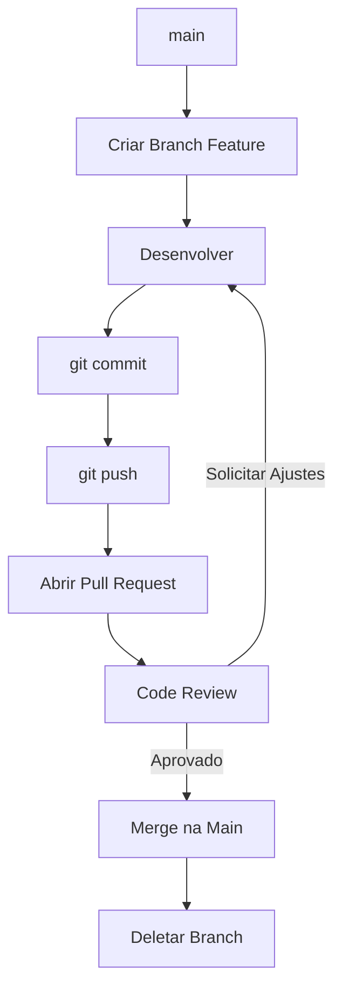
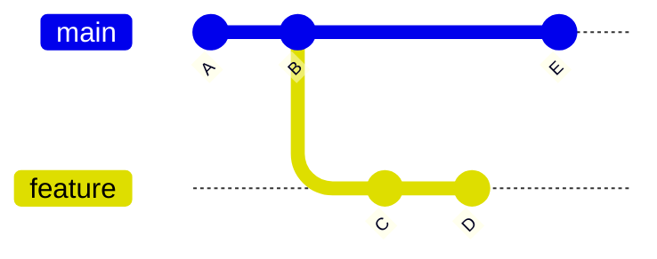
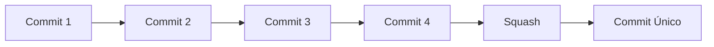
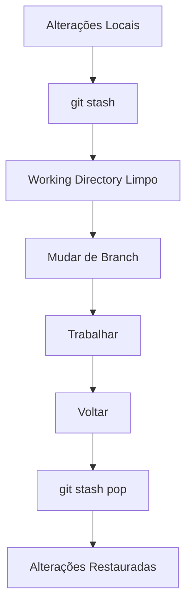

# TIC-Lab-PUCRS

Versionamento de códigos com parceria com +praTI.

# 🚀 Git e GitHub - Resumo das Aulas 1 a 6 modulo

# 🚀 Módulo 2 - Controle de Versão (Intermediário/Avançado)

## 📖 Objetivo do Módulo

Aprofundar os conhecimentos em Git e GitHub, abordando colaboração em equipe, estratégias avançadas de versionamento, recuperação de erros, automação e boas práticas utilizadas no mercado.

---

# Aula 1 - Desenvolvimento Colaborativo

## Pull Request (PR)

O Pull Request é o principal mecanismo de revisão de código em equipes.

### Fluxo Básico

1. Criar uma branch para a funcionalidade.
2. Desenvolver e realizar commits.
3. Enviar a branch para o GitHub.
4. Abrir um Pull Request.
5. Outro desenvolvedor revisa o código.
6. Solicita ajustes ou aprova.
7. Realiza o merge.
8. Remove a branch utilizada.

### Benefícios

* Revisão de código
* Compartilhamento de conhecimento
* Padronização do projeto
* Redução de erros

### Resolução de Conflitos

Durante um PR podem ocorrer conflitos:

* Accept Current Change
* Accept Incoming Change
* Accept Both Changes
* Editar manualmente

### Comandos Importantes

```bash
git push origin -d <branch>
git show-ref <branch>
git remote update origin --prune
```

---

# Aula 2 - Tópicos Avançados de Git

## Rebase

O Rebase reorganiza o histórico de commits de forma linear.

### Vantagens

* Histórico mais limpo
* Facilita auditorias
* Facilita identificação de bugs

### Desvantagens

* Reescreve o histórico
* Pode causar problemas em branches compartilhadas

### Fluxo

```bash
git checkout feature
git rebase main

git checkout main
git merge feature
```

### Aplicações

* Executar testes automaticamente
* Validar builds
* Rodar linters
* Verificações de segurança
* Gerar documentação

---

## Squash

Combina vários commits em apenas um.

### Quando usar

Antes de abrir um Pull Request.

### Exemplo

```bash
git rebase -i HEAD~3
```

Alterar:

```text
pick
pick
pick
```

Para:

```text
pick
squash
squash
```

### Benefícios

* Histórico limpo
* Facilita revisão
* Reduz ruído nos commits

---

# Aula 3 - Resolução de Problemas e Recuperação

## Reset

Remove commits do histórico.

### Soft

Mantém alterações na Staging Area.

```bash
git reset --soft HEAD~1
```

### Mixed (Padrão)

Mantém alterações apenas no Working Directory.

```bash
git reset --mixed HEAD~1
```

### Hard

Remove tudo.

```bash
git reset --hard HEAD~1
```

⚠️ Muito cuidado com esta opção.

---

## Revert

Cria um novo commit que desfaz outro commit.

```bash
git revert <hash>
```

### Vantagens

* Não altera histórico
* Seguro para branches compartilhadas

---

## Amend

Altera o último commit.

```bash
git commit --amend
```

### Utilizações

* Corrigir mensagem
* Adicionar arquivos esquecidos

---

## Cherry Pick

Copia um commit específico para outra branch.

```bash
git cherry-pick <hash>
```

Sem criar commit automático:

```bash
git cherry-pick --no-commit <hash>
```

---

## Reflog

Mostra todas as movimentações do Git.

```bash
git reflog
```

Muito útil para recuperar commits perdidos.

---

# Aula 4 - SHA-1 Hash

## O que é?

Algoritmo criptográfico utilizado pelo Git.

Cada objeto recebe um identificador único.

### Tipos de Objetos

* Blob
* Tree
* Commit
* Annotated Tag

### Características

* 160 bits
* 40 caracteres hexadecimais

Exemplo:

```text
f7d9a3d9f93e83b1f9c3c9b2a87e8b93d91c1e4a
```

### Informações usadas na geração

* Conteúdo
* Autor
* Data
* Estrutura do objeto

### Curiosidade

Existem aproximadamente:

```text
2^160
```

combinações possíveis.

A chance de colisão é extremamente baixa.

---

# Aula 5 - .gitignore

## O que é?

Arquivo responsável por ignorar arquivos e diretórios.

### Benefícios

* Segurança
* Organização
* Performance
* Repositório mais limpo

### Exemplos

```text
node_modules/
bin/
dist/
*.log
*.pyc
.env
.DS_Store
Thumbs.db
```

### Criando

```bash
touch .gitignore
```

### Remover arquivo já rastreado

```bash
git rm --cached arquivo.txt
```

### Site Útil

[https://www.toptal.com/developers/gitignore](https://www.toptal.com/developers/gitignore)

---

# Aula 6 - Tags no Git

## O que são Tags?

Ponteiros estáticos para commits específicos.

Usadas principalmente para versões.

### Exemplo

```text
v1.0.0
v1.1.0
v2.0.0
```

---

## Lightweight Tag

```bash
git tag v1.0.0
```

Apenas aponta para um commit.

---

## Annotated Tag

```bash
git tag -a v1.0.0 -m "Primeira versão"
```

Armazena:

* Autor
* Data
* Mensagem

---

## Comandos

Listar:

```bash
git tag
```

Visualizar:

```bash
git show v1.0.0
```

Enviar:

```bash
git push --tags
```

Excluir:

```bash
git tag -d v1.0.0
```

---

# Aula 7 - Stashing

## O que é?

Permite salvar alterações temporariamente sem realizar commit.

### Salvar alterações

```bash
git stash
```

### Recuperar e remover do stash

```bash
git stash pop
```

### Recuperar sem remover

```bash
git stash apply
```

### Listar

```bash
git stash list
```

### Remover

```bash
git stash drop
```

### Limpar tudo

```bash
git stash clear
```

### Quando usar?

* Troca rápida de branch
* Emergências
* Interrupções durante desenvolvimento

---

# Aula 8 - Chaves SSH

## O que são?

Método seguro de autenticação com GitHub.

### Benefícios

* Mais segurança
* Não precisa digitar senha
* Resistência a phishing
* Melhor gerenciamento de acesso

---

## Gerar Chave

```bash
ssh-keygen -t ed25519 -C "email@github.com"
```

### Iniciar SSH Agent

```bash
eval "$(ssh-agent -s)"
```

### Adicionar chave

```bash
ssh-add ~/.ssh/id_ed25519
```

### Exibir chave pública

```bash
cat ~/.ssh/id_ed25519.pub
```

Depois adicionar no GitHub:

```text
Settings
→ SSH and GPG Keys
→ New SSH Key
```

---

# 🎯 Comandos Mais Importantes do Módulo

```bash
git rebase
git rebase -i
git reset
git revert
git reflog
git cherry-pick
git stash
git stash pop
git tag
git push --tags
git rm --cached
git commit --amend
```

---

# 📌 Resumo Final

Este módulo aprofunda o uso profissional do Git, abordando colaboração com Pull Requests, manipulação avançada de histórico usando Rebase e Squash, recuperação de erros com Reset, Revert e Reflog, gerenciamento de versões com Tags, exclusão de arquivos com .gitignore, armazenamento temporário com Stash e autenticação segura através de chaves SSH.

Esses conceitos são amplamente utilizados em equipes de desenvolvimento e fazem parte do fluxo de trabalho de empresas que utilizam Git e GitHub em ambientes profissionais.

Esse README está mais enxuto e focado nos conceitos e comandos que normalmente aparecem em projetos, entrevistas e avaliações.

### 📌 Fluxograma do Fluxo Básico do Git (Módulo 2)

🌿 Fluxo de Pull Request (Desenvolvimento Colaborativo)



🔀 Rebase vs Merge


📦 Squash



💾 Stash


