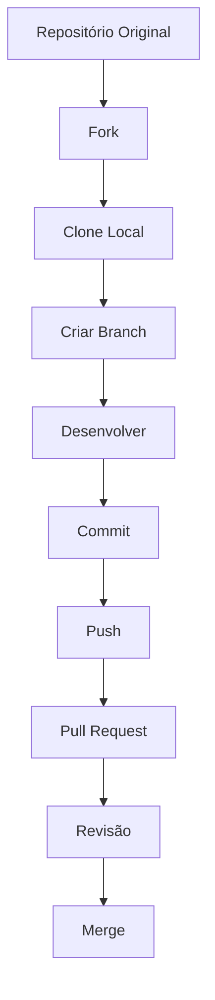
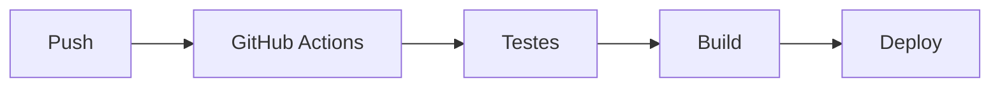
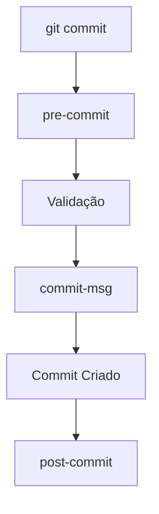
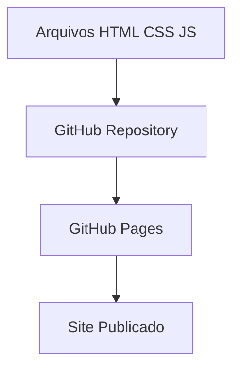

# TIC-Lab-PUCRS

Versionamento de códigos com parceria com +praTI.

# 🚀 Git e GitHub - Resumo das Aulas 1 a 7

# 🚀 Módulo 3 - GitHub Avançado e Automação

## 📖 Objetivo do Módulo

Aprofundar os conhecimentos em Git e GitHub utilizando recursos avançados de colaboração, automação, CI/CD, Git Hooks, GitHub Pages e gerenciamento profissional de projetos.

---

# Aula 1 - Fork e Pull Requests

## O que é Fork?

Fork é uma cópia de um repositório para sua própria conta GitHub.

Permite:

- Desenvolvimento independente
- Contribuição para projetos Open Source
- Aprendizado e experimentação
- Backup do projeto original
- Colaboração com a comunidade

---

## Fluxo Básico

### Criar Fork

1. Acessar o repositório.
2. Clicar em **Fork**.
3. Criar uma cópia na sua conta.

### Clonar o Fork

```bash
git clone <url-do-fork>
```

### Adicionar Repositório Original

```bash
git remote add upstream <url-original>
```

Verificar:

```bash
git remote -v
```

### Sincronizar Fork

```bash
git fetch upstream

git checkout main

git merge upstream/main
```

---

## Pull Request

Fluxo para enviar alterações ao projeto original.

### Etapas

1. Criar branch.
2. Fazer alterações.
3. Commitar.
4. Push para o fork.
5. Abrir Pull Request.
6. Revisão.
7. Aprovação.
8. Merge.

### Boas Práticas

- Descrever claramente as mudanças.
- Manter comunicação com os mantenedores.
- Sincronizar frequentemente com o projeto original.

---

# Aula 2 - Automação e CI/CD

## O que é CI/CD?

### Continuous Integration (CI)

Automatiza testes e validações.

### Continuous Delivery (CD)

Prepara versões para entrega.

### Continuous Deployment

Publica automaticamente novas versões.

---

## Ferramentas do GitHub

- GitHub Actions
- GitHub Packages
- APIs REST e GraphQL
- GitHub Pages
- Webhooks
- Hosted Runners
- Self-Hosted Runners
- Secrets Management

---

## Criando um Workflow

### Estrutura Básica

```yaml
name: CI

on:
  push:

jobs:
  build:
    runs-on: ubuntu-latest

    steps:
      - uses: actions/checkout@v4

      - name: Executar testes
        run: echo "Testando aplicação"
```

---

## Benefícios

- Automatização
- Padronização
- Segurança
- Redução de erros
- Deploy mais rápido

---

# Aula 3 - Funcionalidades Avançadas do GitHub

## Segurança

### Recursos

- Repositórios Privados
- Autenticação 2FA
- Revisões Obrigatórias
- Status Checks
- Code Scanning
- Secret Scanning
- Dependabot
- Dependency Graph

---

## Gerenciamento de Projetos

### Ferramentas

- Projects
- Issues
- Labels
- Milestones
- Wikis
- GitHub Insights

---

## Organizações

### Recursos

- Organizations
- Teams
- Team Sync
- Custom Roles
- Audit Log
- Domain Verification

---

# Aula 4 - Git Hooks

## O que são?

Scripts executados automaticamente antes ou depois de eventos do Git.

---

## Utilizações

- Validação de código
- Testes automatizados
- Notificações
- Deploy automático
- Padronização de commits

---

## Principais Hooks

### Pre Commit

Executa antes do commit.

```bash
pre-commit
```

---

### Commit Message

Valida mensagens.

```bash
commit-msg
```

---

### Post Commit

Executa após commit.

```bash
post-commit
```

---

### Pre Push

Executa antes do push.

```bash
pre-push
```

---

### Server Side

```bash
pre-receive

update

post-receive
```

---

## Tornar Executável

```bash
chmod +x nome-do-hook
```

---

## Ferramentas de Gerenciamento

- Husky
- Lefthook
- pre-commit

---

# Aula 5 - Git Log Avançado

## Histórico de Commits

### Básico

```bash
git log
```

---

### Gráfico

```bash
git log --graph
```

---

### Gráfico Simplificado

```bash
git log --graph --oneline
```

---

### Com Estatísticas

```bash
git log --graph --oneline --stat
```

---

### Filtrar por Autor

```bash
git log --author="Nome"
```

---

### Filtrar por Data

```bash
git log --since="7 days ago"
```

---

### Buscar por Mensagem

```bash
git log --grep="fix"
```

---

### Apenas Merges

```bash
git log --merges
```

---

### Agrupar por Autor

```bash
git shortlog
```

---

# Aula 6 - Garbage Collection

## O que é?

Processo de limpeza e otimização do repositório Git.

Remove objetos inacessíveis.

---

## Executar Manualmente

```bash
git gc
```

---

## Benefícios

- Libera espaço
- Melhora performance
- Compacta objetos
- Organiza histórico interno

---

## Cuidados

Após a execução, objetos antigos podem ser removidos definitivamente.

---

# Aula 7 - Masterizando HEADs

## O que é HEAD?

Ponteiro para o commit atual.

---

## Tipos de HEAD

### HEAD

```text
Commit atual da branch
```

### FETCH_HEAD

```text
Último commit obtido via fetch
```

### MERGE_HEAD

```text
Utilizado durante merges
```

### REBASE_HEAD

```text
Utilizado durante rebase
```

### ORIGIN_HEAD

```text
Última referência do repositório remoto
```

### Detached HEAD

```text
HEAD apontando diretamente para um commit
```

---

## Cuidados

Evite trabalhar longos períodos em Detached HEAD para não perder commits.

---

# Aula 8 - GitHub Pages

## O que é?

Serviço gratuito para hospedagem de sites estáticos diretamente pelo GitHub.

---

## Vantagens

- Gratuito
- HTTPS Automático
- Integração com Git
- Domínio Personalizado
- Fácil Publicação

---

## Estrutura

```text
HTML
CSS
JavaScript
```

---

## Publicação

1. Criar repositório.
2. Adicionar arquivos.
3. Fazer commit.
4. Fazer push.
5. Ativar GitHub Pages.

---

## URL

Site pessoal:

```text
usuario.github.io
```

Projeto:

```text
usuario.github.io/repositorio
```

---

# 🎯 Comandos Mais Importantes do Módulo

```bash
git remote add upstream
git fetch upstream
git merge upstream/main

git log --graph
git log --oneline
git log --grep
git shortlog

git gc

chmod +x hook

git remote -v
```

---

# 📌 Resumo Final

Neste módulo foram estudados recursos avançados do Git e GitHub voltados para colaboração em projetos Open Source, automação com GitHub Actions, integração contínua (CI/CD), gerenciamento de equipes e projetos, Git Hooks, visualização avançada de histórico, manutenção de repositórios com Garbage Collection, gerenciamento dos diferentes tipos de HEAD e publicação de sites utilizando GitHub Pages.

Esses recursos são amplamente utilizados em ambientes profissionais e representam uma evolução natural do fluxo de trabalho apresentado nos módulos anteriores.

---

# 📌 Fluxogramas do Módulo 3

## 🌿 Fluxo de Fork e Pull Request



---

## ⚙️ Fluxo CI/CD



---

## 🪝 Git Hooks



---

## 🌐 GitHub Pages

